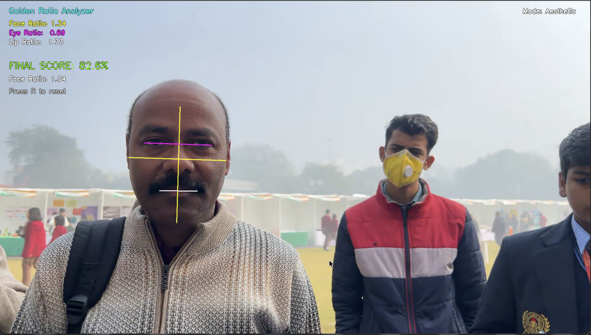

# Golden Ratio Analyzer

A real-time computer vision project exploring facial proportion analysis using the golden ratio (~1.618).

## Recognition

1st Place in CBSE State-Level Science Exhibition  
Selected for and Presented at the CBSE National Science Exhibition

## Features

- Real-time webcam face detection
- Facial landmark tracking using MediaPipe
- Golden ratio-based proportion analysis
- Live visual overlays and ratio measurements
- Symmetry score calculation
- Interactive scan system with progress tracking

## Technologies Used

- Python
- OpenCV
- MediaPipe
- NumPy

## How It Works

The program captures webcam input and detects facial landmarks using MediaPipe Face Mesh. It then measures multiple facial proportions and compares them with the golden ratio to generate an estimated symmetry score.

## Demo Screenshots




## Installation

Clone the repository:

```bash
git clone https://github.com/YOUR_USERNAME/golden-ratio-analyzer.git
```

Install dependencies:

```bash
pip install -r requirements.txt
```

Run the program:

```bash
python golden_ratio_analyzer.py
```

## Controls

- SPACE → Start scan
- R → Reset
- Q → Quit

## Future Improvements

- GUI version
- Automatic report generation
- Image upload support
- Improved facial proportion models
- Better symmetry metrics
